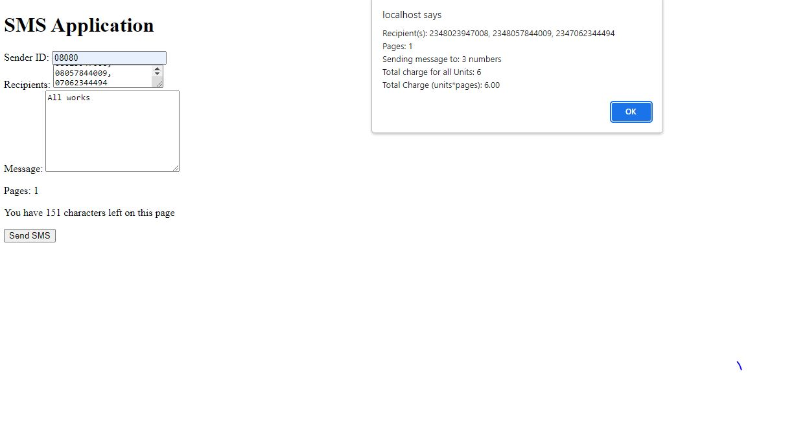

## A website for bulk SMS sales

The project is to build a website for bulk SMS sales.

## perquisite to run this application

you should have docker and composer on your local machine

## Install application on your local Machine

Clone or download the application and run composer install to install all the packages. Edit the .env file.

## Run application

cd into the root of the application folder where you have docker-compose.yml and run

```bash
sail up
```

## View on browser

on your browser check your localhost and enter details.

## interface



